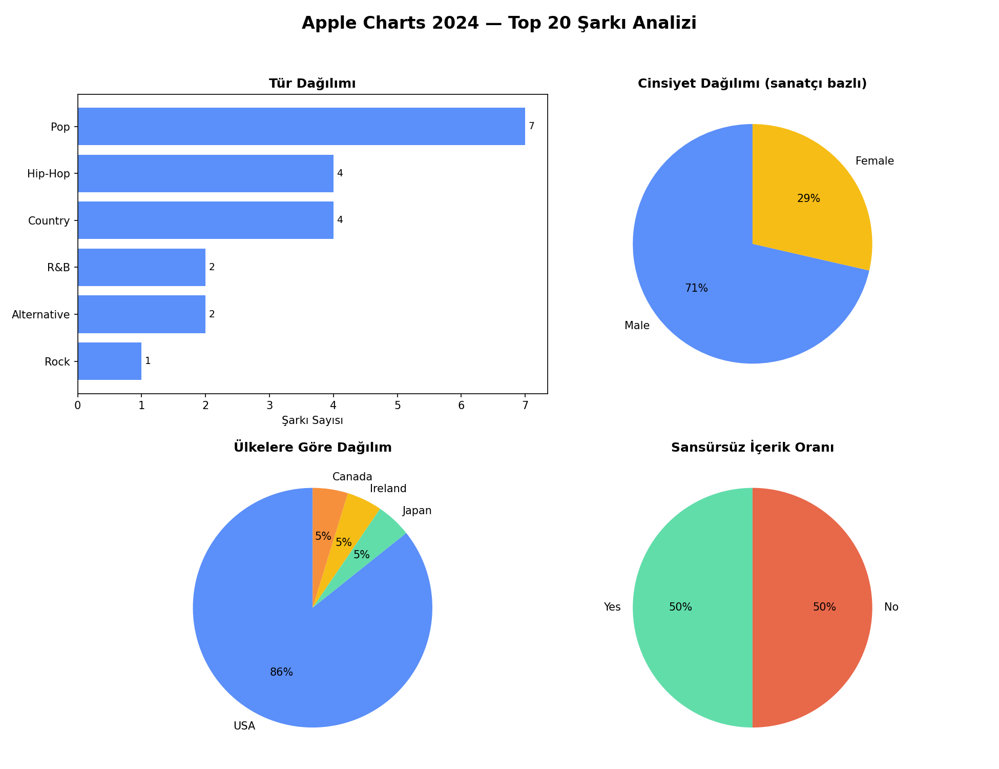

# 🎵 Apple Charts 2024 — SQL Analysis

Apple Music'in **Top Songs of 2024: Global** listesindeki ilk 20 şarkı üzerine kurulmuş,
MySQL ile veri modelleme ve analiz projesi. Şarkılar, sanatçılar, işbirlikleri, türler ve
sansürsüz (explicit) içerik bilgisi ilişkisel bir veritabanında modellenmiş; JOIN, GROUP BY,
CTE (`WITH`) ve window function (`RANK`, `SUM() OVER`) kullanılarak çeşitli sorular
yanıtlanmıştır.

## 📊 Veri Modeli

| Tablo | Açıklama |
|---|---|
| `Artists` | Sanatçı adı, cinsiyeti, ülkesi |
| `Songs` | Şarkı adı, ana sanatçı, süre, Apple Charts sırası |
| `Collabs` | Şarkı başına ek (işbirlikçi) sanatçılar |
| `Genres` | Şarkı başına müzik türü |
| `ExclusiveContent` | Sansürsüz (explicit) içerik barındıran şarkılar |
| `SongFullReport` (view) | Tüm bilgileri tek sorguda birleştiren rapor view'ı |

```
Artists ─┬─< Songs ─┬─< Collabs >─┐
         │           ├─< Genres   │
         │           └─< ExclusiveContent
         └───────────────────────┘ (Collabs.ArtistID de Artists'e bağlanır)
```

## 🔍 Öne Çıkan Bulgular

- İlk 20 şarkının sahiplerinin **%85'i ABD'li**; kalan %15 Kanada, İrlanda ve Japonya
  arasında eşit paylaşılıyor.
- Sanatçıların **%71'i erkek**, %29'u kadın (21 benzersiz sanatçı bazında). Şarkı
  bazında bakılırsa (bazı sanatçıların 2 şarkısı var) oran %65 Erkek / %35 Kadın'dır.
- En popüler tür **Pop** (7 şarkı), onu Hip-Hop ve Country takip ediyor.
- İlk 20 şarkının **yarısı** sansürsüz (explicit) içerik barındırıyor.
- İşbirlikli şarkılar (`Like That`, `A Bar Song` vb.) listenin **%20'sini** oluşturuyor
  (4 benzersiz şarkı; `Like That` iki ayrı işbirlikçiyle 2 satır olduğu için bu satır
  sayısına göre değil, benzersiz şarkı sayısına göre hesaplanmıştır).

## 🧩 Kullanılan SQL Teknikleri

- Çok tablolu `JOIN` / `LEFT JOIN`
- `GROUP BY` + `HAVING`
- Toplulaştırma fonksiyonları (`COUNT`, `AVG`, `SEC_TO_TIME`, `TIME_TO_SEC`)
- **CTE** (`WITH ... AS`) — okunabilir, adım adım sorgular
- **Window functions** — `RANK() OVER (PARTITION BY ...)`, `SUM() OVER (ORDER BY ...)`
  ile kümülatif oranlar
- `CREATE VIEW` — tekrar kullanılabilir rapor katmanı

## 📁 Dosyalar

- [`topsongs_2024_v2.sql`](./topsongs_2024_v2.sql) — veritabanı şeması + tüm sorgular
- [`generate_charts.py`](./generate_charts.py) — sorgu sonuçlarından grafik üretimi (Python/matplotlib)
- `charts_dashboard.png` — tüm analizleri tek görselde birleştiren dashboard

## 📈 Görseller



## ⚙️ Nasıl Çalıştırılır

```bash
# 1. MySQL'de veritabanını kur
mysql -u root -p < topsongs_2024_v2.sql

# 2. Grafikleri üret (opsiyonel, Python gerektirir)
pip install pandas matplotlib
python3 generate_charts.py
```

## 🔗 İlgili Yazı

Bu projenin arka planını ve düşünce sürecini anlatan yazıya [Medium'dan buradan](#) ulaşabilirsiniz.

## 📝 Veri Kaynağı

Apple Music, *Top Songs of 2024: Global* yıl sonu listesi (Aralık 2024).

---
*Bu proje eğitim/portföy amaçlıdır; tüm şarkı ve sanatçı isimleri ilgili hak sahiplerine aittir.*
